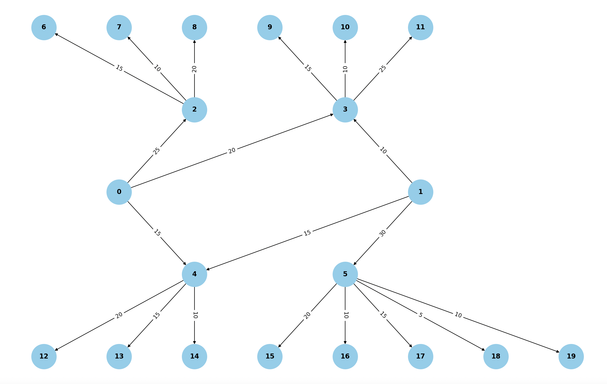
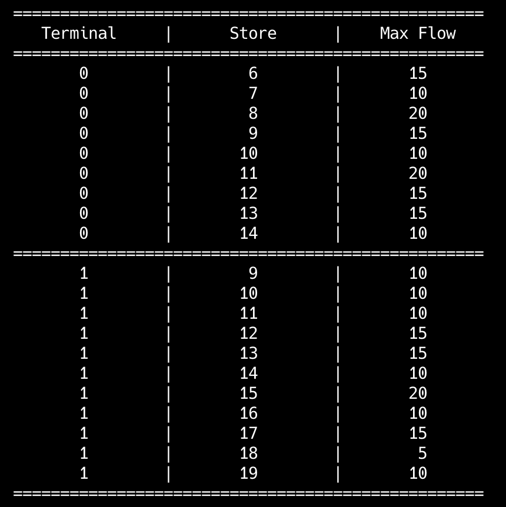
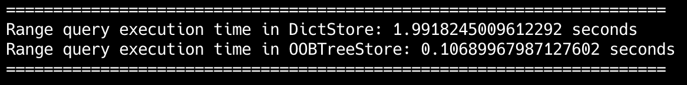

# goit-algo2-hw-03

Design and Analysis of Algorithms: Applied the maximum flow algorithm to model logistics networks, optimizing transportation routes and identifying key network constraints. Additionally, conducted a comparative analysis of OOBTree and dict data structures for range queries, evaluating their performance in terms of efficiency and scalability.

# Task 1

The task is to find the maximum flows for the transport logistic network from Terminal 1 and Terminal 2 to all Stores. We can visualize our network and build a directed graph. Nodes 0 and 1 represents Terminal 1 and Terminal 2; nodes 2, 3, 4, 5 - Warehauses 1, 2, 3, 4; nodes 6-19 - Stores 1-14 correspondently. Here is our transport network graph representation:

We use Edmonds-Karp algorithm for finding the maximum flow from the source (Terminal) to the sink (Store). This algorithm leverages Bread First Search method for finding increasing path from the source to the sink. The maximum flow search results for the given logistics network are in the following table:

The analysis shows that for Stores 1, 2, and 3, the maximum flow is constrained by the bandwidth of Warehouse 1, despite Terminal 1 having a higher capacity. A similar limitation applies to Stores 10, 11, 12, 13, and 14, where the bottleneck is Warehouse 4, even though Terminal 2 offers greater bandwidth.

Stores 4, 5, and 6 can be supplied from both terminals; however, for optimal logistics, it is more efficient to deliver goods from Terminal 1, as it has a higher bandwidth (20) compared to Terminal 2 (10).

Stores 7, 8, and 9 can also receive supplies from both terminals, but since their bandwidths are equal, either terminal can be used without affecting the overall efficiency.

Warehouse 1 and Warehouse 4 are the bottlenecks in this logistic network. For efficiency optimisation it is necessary to increase their bandwidths.

# Task 2

In this task we implemented structure for big data storage on base of an OOBTree and a dictionary. After analizing of results of range queries time execution we conclude that OOBTree data structure are more efficient for big data storage.

